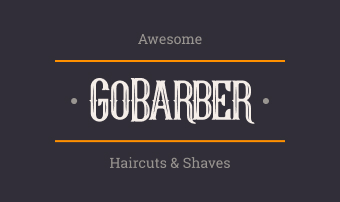

<!-- PROJECT LOGO -->
<br />
<p align="center">
    
  <!-- <h1 align="center">GoBarber - web</h1> -->
  <p align="center">
    Project from bootcamp Rocketseat 💜
  </p>
</p>


<br />
<br />

<!-- TABLE OF CONTENTS -->
## Conteúdos

* [About the Project](#about-the-project)
  * [Built With](#built-with)
* [Getting Started](#getting-started)
  * [Prerequisites](#prerequisites)
  * [Installation](#installation)


<!-- ABOUT THE PROJECT -->
## About The Project

<!-- [![Product Name Screen Shot][product-screenshot]](https://example.com) -->

front-end developed at Rocketseat bootcamp - excellent training. :computer:

Main Learning:
* use of context in React JS;
* use of hooks;
* use of Toast Notification;
* use of styled-components;

### Built With
* [JavaScript](https://www.javascript.com)
* [ReactJS](https://reactjs.org)


<!-- GETTING STARTED -->
## Getting Started

This is an example of how you may give instructions on setting up your project locally.
To get a local copy up and running follow these simple example steps.

### Prerequisites

> Install following Extension - VS Code:
* ESLINT
* DotENV
* EditorConfig
* Material Icon Theme

### Installation

1. Clone the repo
```sh
git clone https://github.com/LFerronato/GoBarber-web
```
2. Install YARN packages
```sh
yarn
```
<!-- 3. Update your env-variables, if necessary. -->

3. Start applications:
```sh
yarn start
```


<!-- MARKDOWN LINKS & IMAGES -->
<!-- https://www.markdownguide.org/basic-syntax/#reference-style-links -->
[product-screenshot]: src/assets/GoBarber-logon-signUp.gif
